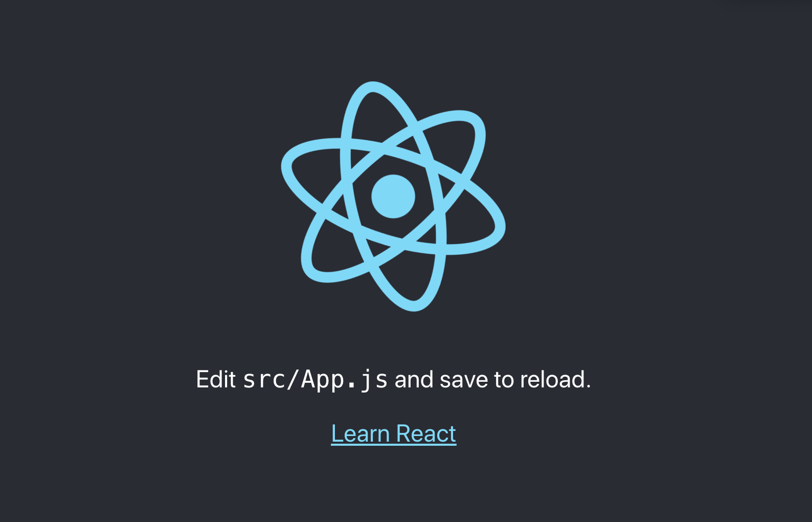
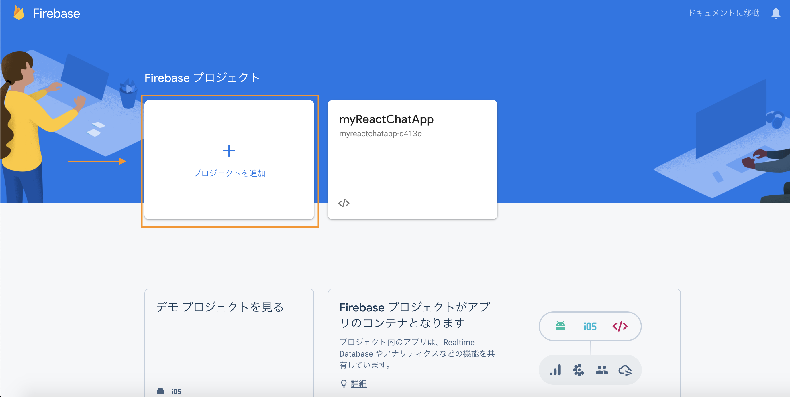
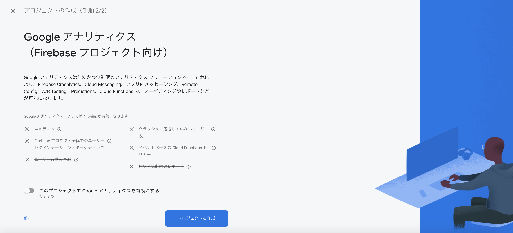
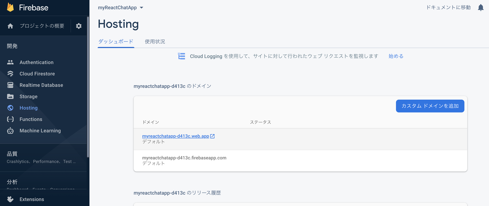
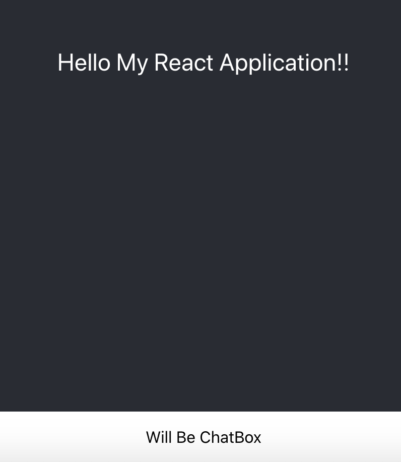
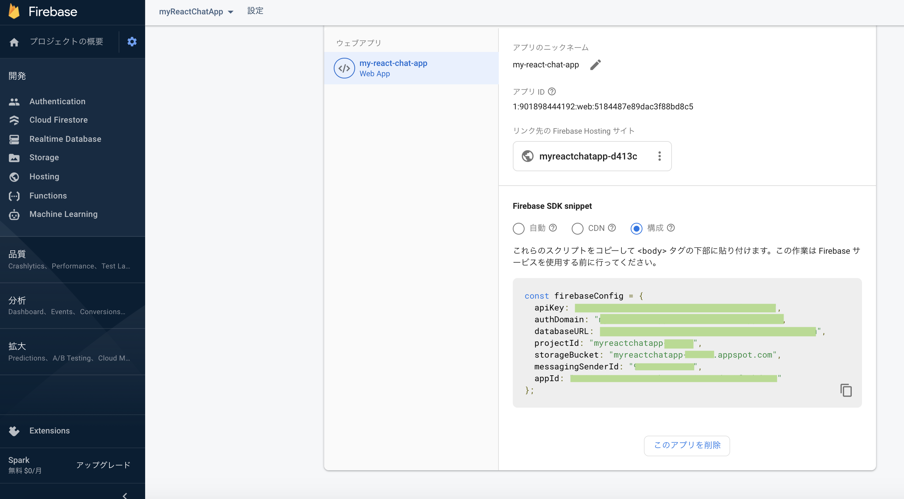

# React に入門してみる。

JavaScript の書き方は ﾁｮｯﾄ わかってきたので、React を使ってアプリケーションを作ってみようと思います。

## React App を作ろう

### `create-react-app` を使うのが楽らしい

```sh:install
npm install -g create-react-app
```

`-g` は必須っぽい[^1]です。global な場所にインストールを行うときにつける option のようです。

### project の作成

```sh
create-react-app my-react-chat-app
```

これで、およそ以下のようなフォルダが (アプほとんど丸ごと) 出来上がります。
出来上がる場所はカレントディレクトリの下です。


```
my-react-chat-app/
├── README.md
├── node_modules/
├── package-lock.json
├── package.json
├── public/
│   ├── favicon.ico
│   ├── index.html
│   ├── logo192.png
│   ├── logo512.png
│   ├── manifest.json
│   └── robots.txt
└── src/
    ├── App.css
    ├── App.js
    ├── App.test.js
    ├── index.css
    ├── index.js
    ├── logo.svg
    ├── reportWebVitals.js
    └── setupTests.js


3 directories, 3 files
```

`git init` とかもされているし、`.gitignore` もありますね。
あとこれは結構迷ったのですが、ソースファイルは基本的に `src` 下に置くらしいです。


#### 動作確認 ( local server の起動)

project の initialize をしたところで、一度、動作確認をしてみます。

以下を実行することで local server が立ち上がります。

```sh
npm start 
```

無事成功すれば、このようなメッセージが出力されます。
そして、自動的にブラウザに切り替わります。(すごい)

```
Compiled successfully!

You can now view sample-app in the browser.

  Local:            http://localhost:3000
  On Your Network:  http://192.168.1.XXX:3000

Note that the development build is not optimized.
To create a production build, use npm run build.

```

切り替わらない場合でも、メッセージ中部にあるように、ブラウザから `localhost:3000` にアクセスすると、立ち上がったサービス (アプリ?) をみることができます。


さて、立ち上がった先では React のアイコンっぽい、atomic な何かしらがくるくる回る画面が出てきます。これで OK です。
ソースファイルを編集すると、この画面が変わります (だいたい)。




## Firebase 周り
次は firebase 周りの設定をします。firebase にデプロイしない場合は、この部分をスキップして良いです。
(自分のメモのために残します)

### firebase CLI (SDK) をインストール
まずは firebase の SDK である `firebase-tools` をインストールします。SDK なので global にインストールしておくと良いでしょう。

```sh
npm install -g firebase-tools
```

### ライブラリのインストール
firebase のライブラリ (?) をインストールします。
これはプロジェクト内のソースで読み出すものなので、local で install します。

```sh
npm install firebase
```

### (まだの方) firebase に Google アカウントで login してプロジェクトを作成します。

firebase に Google アカウントで login して、プロジェクトを作成してきます。

1. project を追加 (作成) を選びます。


2. project に名前をつけます。 (良かれば規約に同意して、続行します)


3. 今回はお試しなので Google アナリティクスは off (disable) にしておきます。


4. 一旦完成です (やったぜ)


### SDK とサービスの関連付け

* local の firebase SDk と サービスとしての firebase の紐付けに login を行います。

```
firebase login
```

ブラウザが開いて、Google アカウントを選択すれば、関連付けが完了すると思います。

* local に作成したプロジェクトと、firebase 上のプロジェクトの紐付けを行うために initialize をします。

```
firebase init
```

実行するとこんな感じで「何かを選択しろ」と言わんばかりの待ち受けイベントが起こります。

```
(*'-') < firebase init

     ######## #### ########  ######## ########     ###     ######  ########
     ##        ##  ##     ## ##       ##     ##  ##   ##  ##       ##
     ######    ##  ########  ######   ########  #########  ######  ######
     ##        ##  ##    ##  ##       ##     ## ##     ##       ## ##
     ##       #### ##     ## ######## ########  ##     ##  ######  ########

You're about to initialize a Firebase project in this directory:

  /Users/sudachi/Documents/js/sample-app

? Which Firebase CLI features do you want to set up for this folder? Press Space to select features, then Enter 
to confirm your choices. (Press <space> to select, <a> to toggle all, <i> to invert selection)
❯◯ Database: Deploy Firebase Realtime Database Rules
 ◯ Firestore: Deploy rules and create indexes for Firestore
 ◯ Functions: Configure and deploy Cloud Functions
 ◯ Hosting: Configure and deploy Firebase Hosting sites
 ◯ Storage: Deploy Cloud Storage security rules
 ◯ Emulators: Set up local emulators for Firebase features
 ◯ Remote Config: Get, deploy, and rollback configurations for Remote Config
```

お試しで行う時は `Hosting` にしておくと良いでしょう。(というか、まだ不勉強で良くわかってません。ごめんなさい)

Hosting まで `❯` を持っていって、`[space]` を押下すると `◯` が `◉` になります。なったら `[Enter]` で OK です。

```
? Which Firebase CLI features do you want to set up for this folder? Press Space to select features, then Enter to confirm your choices. 
 ◯ Database: Deploy Firebase Realtime Database Rules
 ◯ Firestore: Deploy rules and create indexes for Firestore
 ◯ Functions: Configure and deploy Cloud Functions
❯◉ Hosting: Configure and deploy Firebase Hosting sites
 ◯ Storage: Deploy Cloud Storage security rules
 ◯ Emulators: Set up local emulators for Firebase features
 ◯ Remote Config: Get, deploy, and rollback configurations for Remote Config
```

さて、次は `project` を選択するイベントです。

```
? Please select an option: (Use arrow keys)
❯ Use an existing project 
  Create a new project 
  Add Firebase to an existing Google Cloud Platform project 
  Don't set up a default project 
```
ここでは `❯ Use an existing project` を選択して、先ほど作った firebase プロジェクト `myreactchatapp-d413c (myReactChatApp)` (とか) を選択します。(login が正しく行われていれば、プロジェクトが表示されると思います。)

あといくつか選択イベントがありますが、~~めんどうだし、良くわからないので~~ たぶんあとで設定とかもできるので、`[Enter]` をぽちぽちして先に進みます。

```
? What do you want to use as your public directory? 
? Configure as a single-page app (rewrite all urls to /index.html)? No
? Set up automatic builds and deploys with GitHub? No
✔  Wrote /404.html
✔  Wrote /index.html

i  Writing configuration info to firebase.json...
i  Writing project information to .firebaserc...

✔  Firebase initialization complete!
```

こんな感じのメッセージが出たら firebase のイニシャライズは完了です。多分 `.firebaserc` とか `firebase.json` が増えているのではないでしょうか。


### deploy 元のディレクトリの変更
firebase の設定では、デフォルトの deoloy 元となるディレクトリは `public/` です。

しかし、`npm run build` により作成されるのは `build/` の下です。なので、`firebase.json` を変更することで、`build/` を見るようにします。(さっきの選択イベントでも選べた気がしますが、気にしません。)


```firebase.json
{
  "hosting": {
    "public":"build",
    "ignore": [
      "firebase.json",
      "**/.*",
      "**/node_modules/**"
    ]
  }
}
```

### deploy

以下を実行して firebase に deploy します。

```sh
npm run build
firebase deploy
```

ドメインは firebase のコンソールの Hosting からみることができます。



まだ何もいじっていないので、アクセスすると、先ほどの atomic なページが表示されれば、デプロイは完了です。


## Application を作っていくぞ
前置きが長くなりましたが、アプリケーション部分を作っていきましょう。

### フロントページの編集
React の用語では「Container」というらしいです。

先ほどの React のアイコンがくるくるしていたページを編集します。

編集するには `src/App.js` をいじります。[^2]
この `App.js` には `App` というものを定義して `export` することで、`src/index.js` から呼び出されてレンダリングされる、という経路のようです。

`App.js` の中で `App` を定義して `render()` を呼び出せるようにします。この戻り値 ( `return()` )として HTML (JSX とかっていうんでしたっけ) を書くことでコンテナにレンダリングされます。

ここで一点注意ですが、`render( return (ここ) ) ` に書く HTML は、全体を `<div> ~ </div>` に囲まれるようにします。

```js:src/App.js
import logo from './logo.svg';
import './App.css';

function App() {
  return (
    <div className="App">
      <header className="App-header">
        <p> Hello My React Application!! </p>
      </header>
    </div>
  );
}

export default App;

```

こんな感じで編集します。
すると、コンテナが以下のような感じになると思います。


App ないに `<div>` で囲まれた HTML を書くことで手軽にレンダリングができました。

### Component
さて、次に Component を使ってみましょう。

(完全初心者なのでユルシテ)「画面の要素を、部品単位に分割したもの」と思えば良いと思います。ぼくはそう考えてます。

#### Define:
まずは Component を作成しましょう。
最初に置き場所を作ります。

```
mkdir src/components
```

ディレクトリの構成はこんな感じになります。
今作成した `components/` の下にコンポーネントを js ファイルで書きます。それを `App.js` から呼び出すことで画面に登場！、というストーリーになります。

```
src/
├── App.js
├── ...
├── components/
├── ...
└── setupTests.js
```

今回は Chat アプリを作りたいので、チャットをするときのユーザ名メッセージと入力する部分を部品として分割して作成します。

```sh
touch src/components/ChatBox.js
```


```
src/
├── App.js
├── ...
├── components
│   └── ChatBox.js
├── ...
```

まずは、以下のように、ChatBox を作るのだ、という意思を表明します。

```js:src/components/ChatBox.js
import React from 'react';

export default class ChatBox extends React.Component {
  render() {
    return (
        <div className="ChatBox">
          <p>Will Be ChatBox</p>
        </div>
    );
  }
}
```

これで部品の宣言は完了です。次はこれを `App.js` から呼び出して、使ってみます。


#### Use

```js:src/App.js
import logo from './logo.svg';
import './App.css';

import ChatBox from './components/ChatBox.js';

function App() {
  return (
    <div className="App">
      <header className="App-header">
        <p> Hello My React Application!! </p>
      </header>

      <ChatBox />
    </div>
  );
}

export default App;
```



画面がこんな感じに変わりました。下に ChatBox 部分がきちんと作られていることがわかります。

あとは Component の中身を編集すれば OK です。

さて、ここからは完成にむけて走るだけなのですが、ほとんど参考元と違いがありませんので、ソースコードは一気に貼ってしまいます。

### 出来上がったものがこちらになります:

```js:src/App.js
import logo from './logo.svg';
import './App.css';

import { firebaseDB } from './firebase/index.js'

import React, { Component } from 'react';

import ChatBox from "./components/ChatBox.js"
import Message from "./components/Message.js"

const messageRef = firebaseDB.ref('messages')

class App extends Component {
  constructor(props) {
    super(props);

    this.onTextChange = this.onTextChange.bind(this)
    this.onButtonClick = this.onButtonClick.bind(this)

    this.state = {
      text: "",
      user_name: "",
      messages: [],
    }
  }

  render() {
    return (
      <div className="App">
        <div className="App-header">
          <h2>Sudachi React Chat App</h2>
        </div>

        <div className="MessageList" >
          {this.state.messages.map( (m, i) => {
            return <Message key={i} message={m} />
          })}
        </div>

        <ChatBox onTextChange={this.onTextChange} onButtonClick={this.onButtonClick} />

      </div>
    );
  }

  // 文字が入力される度に、state の更新を行う method (event 処理) の定義
  onTextChange(e) {
    if (e.target.name == 'user_name') {
      this.setState({
        "user_name": e.target.value,
      });
    } else if (e.target.name == "text") {
      this.setState({
        "text": e.target.value,
      });
    }
  }

  // 送信ボタン押下時の event 処理
  onButtonClick() {
    // 簡易的バリデーション
    if (this.state.user_name == '') {
      alert('user name is empty!')
      return
    } else if (this.state.text == '') {
      alert('text is empty!')
      return
    } 

    console.log('message pushed!')
    messageRef.push({
      "user_name": this.state.user_name,
      "text": this.state.text,
    })
    console.log(messageRef);

  }

  // DB の更新をキャッチする Listener の実装
  componentWillMount() {
    messageRef.on('child_added', (snapshot) => {
      const m = snapshot.val()
      let msgs = this.state.messages

      msgs.push({
        'text': m.text,
        'user_name': m.user_name,
      })

      this.setState({
        message: msgs
      });
    })
  }
}

export default App;

```

```js:src/components/ChatBox.js
import React from 'react';

export default class ChatBox extends React.Component {
    render() {
        return (
            <div className="ChatBox">
                <div className="">
                    <input name="user_name" className="" onChange={this.props.onTextChange} placeholder="user name" />
                </div>

                <textarea name="text" className="" onChange={this.props.onTextChange} />
                <button className="" onClick={this.props.onButtonClick} >送信</button>
            </div>
        );
    }
}
```

```js:src/components/Message.js
import React from 'react';

export default class Message extends React.Component {
    render() {
        return (
            <div className="Message">
                <div className="">
                    <p className="">@{this.props.message.user_name}</p>
                    <p className="">{this.props.message.text}</p>
                </div>
            </div>
        )
    }
}
```

### firebase Realtime Database
最後に、firebase の Realtime Database との連携の説明をして終わります。

firebase Realtime Database を使うには、少なくとも2つ config を書く必要があります。

1. `config.js` 
2. `database.rules.json`

#### `config.js` の取得:
firebase のコンソールから設定に必要な情報を取得します。
これは、歯車マークを押して、「プロジェクトを設定」から下の方にスクロールすると出てくると思います。

「マイアプリ」の「Firebase SDK snippet」を参照します。



置き場所ですが、`src/firebase` 下に置いておきましょう。

```
src
├── App.js
├── ...
├── components/
|   ├── ChatBox.js
|   └── Message.js
├── firebase/
|   ├── config.js
|   └── index.js
├── ...
```

だいたいこんな感じです。そして先ほど取得した情報を `src/firebase/config.js` の中に貼り付けます。


```js:src/firebase/config.js
export const firebaseConfig = {
  apiKey: "HogeFugahogeraNanntokaKanntokaApiKeyTekinayatu",
  authDomain: "exapmle.firebaseapp.com",
  databaseURL: "https://example.firebaseio.com",
  projectId: "myreactchatapp-hogehoge",
  storageBucket: "myreactchatapp-hogehoge.appspot.com",
  messagingSenderId: "XXXXXXXXXXXX",
  appId: "1:XXXXXXXXXXXX:web:XXXXXXxXXxxxXxXXxxXxX"
};
```

`src/firebase/index.js` の中には DB インスタンス (?) が入っています。こういうものを用意しておくと、呼び出すときに export したやつを参照すれば良いだけなので、楽で良い、とのことでやっておきました
( ･ㅂ･)و̑ ｸﾞｯ

```js:src/firebase/index.js
import firebase from 'firebase';
import { firebaseConfig } from './config.js';

export const firebaseApp = firebase.initializeApp(firebaseConfig);
export const firebaseDB = firebase.database();

```

最後に `database.rules.json` を書いて deploy すれば、この設定が反映されてめでたいことになります。


```json:databse.rules.json
{
    "rules": {
        ".read": true,
        ".write": true
    }
}
```

これは project の真下に配置します。( `src/` と同じ階層 )

```
.
├── README.md
├── build/
├── database.rules.json
├── firebase.json
├── node_modules/
├── package-lock.json
├── package.json
├── public/
└── src/
```

最終的なプロジェクト構成はこんな感じになりました。

## deploy!!

```
npm run build
firebase deploy
```

今回はここまでになります。(・ω・)ノシ


## Link:
* [React & Firebaseで簡単なChatアプリを作ってみた](https://qiita.com/kazushikawamura/items/58ea222b3cc289882d79)
* [初めてのFirebaseを触ってみる(Database)](https://qiita.com/watataku8911/items/ac040f4671c0f9a62bd4)
* [Firebase apiKey ってさらしていいの? ほんとに?](https://qiita.com/hoshymo/items/e9c14ed157200b36eaa5)


[^1]: 一度、プロジェクト local にインストールして使おうとしたけど PATH とかが面倒でやめました。特にこだわりがなければ global に install しちゃうのがいいと思います。ちなみに、私の環境では `create-react-app` は `$HOME/.nodebrew/current/bin/create-react-app` に配置されました。

[^2]: `src/index.js` をいじる方法や、他のエンドポイント (?) を作成することもできると思いますが、せっかく react-create-app で作ったので、ここでは用意されたものを使います。
